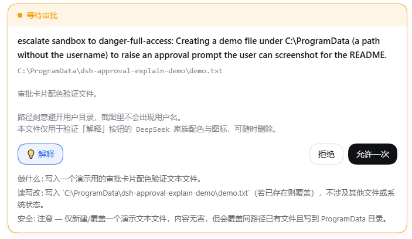

# dsh-approval-explain

中文 | [English](README.md)

给 [DeepSeek Harness](https://github.com/deepseek-ai/deepseek-harness) 的审批卡片加一个**「解释」按钮**：点一下就用一次模型调用，告诉你要批准的东西*到底想干什么*。



```
┌─ ● 等待审批 ────────────────────────────────────────┐
│                                                    │
│  escalate sandbox to danger-full-access: 用户要求…  │
│  Set-Content -LiteralPath 'D:\Downloads\notes.md'  │
│  …（很长的脚本文本）                                 │
│                                                    │
│  [ 💡解释 ]                  [ 拒绝 ]  [ 允许一次 ] │
│                                                    │
│  做什么: 在 D:\Downloads 下新建（或覆盖）notes.md…  │
│  读写改: 写入 D:\Downloads\notes.md；不删除其他文件  │
│  安全: 注意 — 会覆盖同名文件，本身不涉及提权或删除   │
└────────────────────────────────────────────────────┘
```

## 为什么需要它

dsh 的审批卡片里有一块「详情」区，用来显示这次要批准的内容。它由一个**只认 `command` 字段**的提取器填充：

```js
// packages/client/ui-chat/src/client/chat/ApprovalCommand.tsx
return typeof args.command === 'string' ? args.command : undefined
```

于是只有 `bash` / `pwsh` 这类参数名恰好叫 `command` 的工具能把内容铺进去。`write` / `edit` 这类参数是 `file_path` + `content` 的工具，**那一块永远是空的**。

结果就是：一张写着「escalate sandbox to danger-full-access」的卡片，却看不到自己到底要批准什么。

本插件做两件事：

1. **不让它留白** —— 接管详情区，兼容 `command` / `file_path` / `path` 三种参数形态；
2. **让模型替你读** —— 「解释」按钮调一次 LLM，返回固定的三行结论：做什么 / 读写改 / 安全。

「解释」按钮复用原生按钮几何（`outline`、36px 胶囊），因此与「拒绝 / 允许一次」齐平，配色取 DeepSeek 家族色（`--dsw-static-deepseek-50` / `-500`），并带一个 💡 前导图标。

## 安装

需要 **pnpm**（`dsh plugin` 是 pnpm 的转发壳）。没装的话先启用：

```sh
corepack enable pnpm     # Node 自带 corepack，推荐
# 或
npm i -g pnpm
```

然后：

```sh
dsh plugin --profile web add github:Martlet-Tech/dsh-approval-explain
```

装完**重启** dsh / DShell —— profile 只在启动时读一次。

### 万一没生效

`dsh plugin add` 会把包装进 profile 的 `node_modules`，并因为本包声明了
`dsh.bundle` 而把它追加进 `dsh.profile.bundles`。若那条追加没发生
（例如 pnpm 版本行为差异），手动补一行即可：

```jsonc
// $DSH_HOME/profiles/web/package.json
"dsh": {
  "profile": {
    "bundles": [
      "@deepseek-ai/dsh-base",
      "@deepseek-ai/dsh-web-app",
      "dsh-approval-explain"   // ← 加这行
    ]
  }
}
```

用 `dsh --profile web --dump-config` 验证：输出里应出现
`# == dsh-approval-explain` 这一层。

### 为什么不需要构建授权

本包**直接分发构建产物**（`lib/` 已提交进仓库），所以不跑 `prepare`，
也就不会触发 pnpm ≥10 对 git 依赖的 `allowBuilds` 授权提示。

### 卸载

```sh
dsh plugin --profile web remove dsh-approval-explain
```

本插件是**叠加式**的：它靠优先级接管审批卡片，**不禁用** dsh 的任何 Loader 行。所以卸载或加载失败时，dsh 原本的行为完全回来。

`/explain <内容>` 也可以直接在输入框里用，不依赖按钮。

## 要求

- dsh `0.1.5-rc.1` 或更新
- 一个已配置的模型 provider（复用你当前会话的 provider/model，无需额外配置）
- 仅 Web GUI（`dsh web`）

## 怎么找到别的插件

dsh **没有插件商店** —— 没有官方市场、没有远程注册表、GUI 里也不能浏览安装。
发现渠道是 GitHub topic：

- [`github.com/topics/dsh-plugin`](https://github.com/topics/dsh-plugin) — 官方 README 推荐的唯一渠道
- [`awesome-dsh-plugin`](https://github.com/awesome-dsh-plugin/awesome-dsh-plugin) — 社区自建精选列表

安装一律走 `dsh plugin --profile <name> add <spec>`，其中 `<spec>` 可以是
npm 包名、`github:user/repo`、tarball 或本地路径。

## 它怎么工作

整条链路走的都是 dsh 已有的机制，没有新增远程端点：

```
浏览器「解释」按钮
   └─ ctx.remote.commands.execute(sessionId, '/explain <内容>', [])
        └─ 主机侧 /explain 命令 handler      ← 跑在 Host，能调 ctx.llm
             └─ ctx.llm.stream({ provider, model, messages, system })
                  └─ 文本块累积 → { kind: 'success', text }
        └─ 结果同步返回并就地展开
```

两个设计决定值得说明：

**为什么用「人类命令」而不是自建远程 API。** `ctx.llm` 是主机侧服务且没有 `@Remote`，浏览器够不着它。自建 `@Remote` 端点则需要 Typert 代码生成，而它只扫描 dsh 仓库内的 `packages/`。`ctx.remote.commands.execute()` 早已挂载，命令 handler 又跑在主机侧 —— 这是唯一现成、无需改 dsh 的通道。`/compact` 就是这条链路的既有先例。

**为什么整份代码零 import。** 插件作为树外包经 profile 的 junction 装载；Node 从 junction 的真实路径向上找 `node_modules`，那里没有 `@deepseek-ai/*`。所以主机半用 `ctx.get('llm')` 取服务、按 `Message` 结构字面构造消息，不 import 任何包。

## 已知限制

- **每次点击会留痕**：命令系统会记 `command/run` + `command/done` 两行到会话日志。这是可审计性，不是零痕迹。
- **解释要花 token**：一次约 700 输出 token 上限的小请求。dsh 对 LLM 调用没有审批闸门，所以这一步不会有二次确认。
- **接管了整张审批卡片**：因为「拒绝 / 允许一次」那一行由 dsh 自己渲染、没有暴露插槽，要把按钮放进那一行只能接管整卡。如果 dsh 未来改了卡片结构，本插件需要跟进。
- **耦合了 `StreamChunk` 字段名**：`text-delta` / `block-end` / `finish` 是当前版本的结构，零依赖的代价就是要跟着版本走。
- 目前只做**解释**。不改变批准结果，也不缓存结论。

## 许可

MIT
